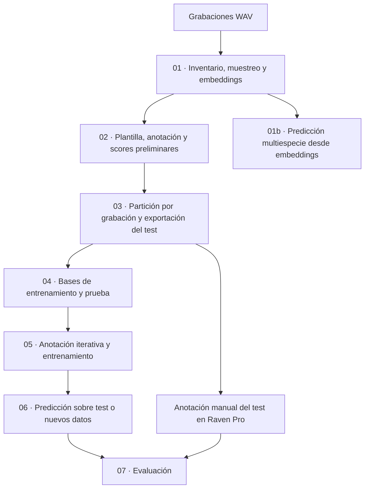

# Bioacoustic Classifier Pipeline

Flujo de trabajo en notebooks de Python para crear, aplicar y evaluar clasificadores bioacústicos a partir de grabaciones de audio. Utiliza **Perch** para extraer embeddings —representaciones numéricas del sonido— y **Perch-Hoplite** para almacenarlos, buscar señales similares y entrenar clasificadores mediante anotación humana iterativa (*agile modeling*).

El proyecto permite trabajar con una especie o vocalización objetivo y también incluye una ruta de **predicción multiespecie** que reutiliza los embeddings con la cabeza clasificadora original de Perch.

## Qué permite hacer

- Inventariar archivos WAV y seleccionar muestras reproducibles por deployment (sitio o unidad de despliegue) y tiempo.
- Generar una base de embeddings con SQLite y USearch, con manifiestos y controles de consistencia.
- Buscar vocalizaciones similares a una plantilla, escucharlas y etiquetarlas manualmente.
- Construir una partición de entrenamiento y prueba por grabación completa, estratificada según scores preliminares.
- Entrenar y refinar un clasificador lineal sobre los embeddings.
- Exportar predicciones por ventana y evaluarlas frente a anotaciones manuales.
- Obtener predicciones multiespecie y resúmenes por deployment y día u hora.

Los notebooks requieren configuración y revisión humana. Los audios, las bases de datos, las anotaciones de referencia y los clasificadores personalizados deben aportarse o generarse durante el proceso; no están incluidos en el repositorio.

## Flujo de trabajo



La ruta `01b` es opcional y puede ejecutarse después de `01`, sin completar el entrenamiento personalizado de los notebooks `02` a `07`.

## Notebooks

| Notebook | Función | Salidas principales |
|---|---|---|
| [01 · Embeddings](notebooks/01_pipeline_embeddings.ipynb) | Inventaría los WAV, selecciona una muestra y genera embeddings con `perch_8`. | Base Hoplite y carpeta `sampling_audit/` con manifiesto, configuración y validaciones. |
| [01b · Multiespecie](notebooks/01b_multispecies_from_embeddings.ipynb) | Aplica la cabeza original de Perch a embeddings existentes, con selección geográfica de especies. | Predicciones Parquet, listas de especies y resúmenes CSV. |
| [02 · Pattern matching](notebooks/02_pipeline_pattern%20matching.ipynb) | Busca ejemplos similares a una plantilla, permite anotarlos y entrena un clasificador preliminar. | Modelo inicial, predicciones por ventana y resumen de scores por grabación. |
| [03 · Partición estratificada](notebooks/03_pipeline_Particion_estratificada_por_score.ipynb) | Divide grabaciones completas por quintiles de score y exporta audios para revisión. | `recording_split.csv`, tablas de train/test, manifiesto de partición y audios de test. |
| [04 · Bases de train y test](notebooks/04_pipeline_Train_and_Test_DB_cierre_y_limpieza.ipynb) | Copia y depura la base completa según la partición. | Bases Hoplite separadas y CSV de auditoría de anotaciones retiradas. |
| [05 · Agile modeling](notebooks/05_pipeline_Agile%20modeling.ipynb) | Alterna búsqueda, escucha, anotación y reentrenamiento sobre train; explora un umbral en validación interna. | Clasificadores `.pt` y métricas de validación. |
| [06 · Predicción](notebooks/06_pipeline_predecir.ipynb) | Aplica el clasificador a una base compatible de test o de nuevos datos. | CSV con logits por ventana para la etiqueta seleccionada. |
| [07 · Evaluación](notebooks/07_pipeline_evaluar_modelo.ipynb) | Contrasta predicciones con anotaciones manuales y duraciones. | Métricas, intervalos de confianza, análisis de umbrales y tablas de errores. |

## Requisitos e instalación

El entorno se declara en [`pyproject.toml`](pyproject.toml) y se fija mediante [`uv.lock`](uv.lock). Requiere **Python 3.10** e incluye Perch-Hoplite `1.0.2`, TensorFlow `2.20.0`, NumPy `2.0.2`, USearch `2.25.2`, pandas, scikit-learn y JupyterLab.

Necesitarás Git, `uv`, acceso a tus grabaciones y almacenamiento suficiente para los embeddings, las copias de las bases train/test y los audios exportados. Raven Pro se utiliza fuera de Python para la anotación manual del conjunto de prueba.

Desde una terminal:

```bash
git clone https://github.com/telesiglab/bioacoustic_classifier_pipeline.git
cd bioacoustic_classifier_pipeline
uv python install 3.10
uv sync --locked
uv run jupyter lab
```

También puedes abrir el proyecto en VS Code con soporte para Python y Jupyter, y seleccionar el intérprete de `.venv` como kernel.

El notebook `01` está preparado para Windows nativo. Otros notebooks contienen ejemplos de rutas de WSL/Linux, como `/mnt/d/...`. **Adapta las rutas de todos los notebooks al entorno que utilices**; sus valores predeterminados no describen una única ejecución ya conectada. El modelo `perch_8` está configurado para poder trabajar en CPU. La carga inicial del modelo puede requerir descargar sus recursos.

## Preparar los datos

El notebook `01` espera archivos WAV y permite configurar su organización mediante `dataset_fileglob` y `group_depth`. Por ejemplo, con `dataset_fileglob = "*/*/*.wav"` y `group_depth = 1`:

```text
audios/
├── deployment_01/
│   └── Data/
│       └── 20260115_060000.wav
└── deployment_02/
    └── Data/
        └── 20260115_061000.wav
```

La primera carpeta identifica el deployment. Ajusta `date_regex` y `date_format` para extraer la fecha de los nombres de tus archivos.

Antes de generar embeddings, configura:

| Parámetro | Qué define |
|---|---|
| `dataset_name`, `dataset_base_path` | Identidad del conjunto y carpeta de audios. |
| `dataset_fileglob`, `group_depth` | Búsqueda de WAV y nivel que identifica el deployment. |
| `db_workspace_root`, `sample_name` | Ubicación y nombre de la base generada. |
| `sampling_strategy`, `random_seed` | Estrategia de selección y reproducibilidad. |
| `model_choice`, `batch_size` | Modelo de embeddings y tamaño de lote. |

Las estrategias de muestreo disponibles son `all`, `random_fraction`, `alternate_days`, `stratified_month` y `systematic_files`. `alternate_days` alterna los días observados de cada deployment; no necesariamente días consecutivos del calendario.

La extracción lee los audios desde sus ubicaciones originales, sin copiarlos. Conserva esas rutas para las etapas posteriores de escucha y anotación. Guarda la base Hoplite en un disco local estable, preferiblemente SSD.

## Entrenar y evaluar un clasificador personalizado

1. **Generar embeddings (`01`).** Revisa el inventario y la muestra antes de iniciar el procesamiento. Conserva `sampling_audit/sample_manifest.csv`. Si cambias la selección, utiliza otro `sample_name` para evitar mezclar muestras.
2. **Obtener scores preliminares (`02`).** Configura la base, `query_uri` y `query_label`. Selecciona una plantilla representativa, revisa los resultados y guarda las etiquetas. Entrena el modelo preliminar y genera el resumen `*_recording_summary.csv` que utilizará el notebook siguiente.
3. **Separar train y test (`03`).** Conecta `PATH_TO_RECORDING_SUMMARY` con ese resumen y `PATH_TO_EMBEDDINGS` con el archivo `hoplite.sqlite`. Ajusta `N_TEST_FILES` y `SEED`. Por defecto se usan cinco estratos y `preliminary_top_k_mean_score`. Todas las ventanas de una grabación permanecen en el mismo conjunto.
4. **Crear las bases separadas (`04`).** Configura `COMPLETE_DB_PATH`, `TRAIN_DB_PATH`, `TEST_DB_PATH` y `SPLIT_CSV`. En el código actual, ambas llamadas usan `clear_annotations=True`: las anotaciones preliminares de train y test se exportan para auditoría y se eliminan de las nuevas bases. El entrenamiento de `05` comienza anotando nuevamente sobre train.
5. **Anotar y entrenar (`05`).** Trabaja con `train_db`, guarda las anotaciones y repite el ciclo de búsqueda y entrenamiento. Actualiza `model_path` y `model_output_path` entre iteraciones. Define el umbral operativo con los datos de entrenamiento/validación antes de consultar los resultados del test.
6. **Predecir (`06`).** Configura `DB_PATH`, `MODEL_PATH`, `OUTPUT_CSV_PATH` y `TARGET_LABEL`. Para evaluación, conserva `EXPORT_LOGIT_THRESHOLD = -np.inf` para exportar todas las ventanas. La base debe utilizar embeddings compatibles con el clasificador.
7. **Evaluar (`07`).** Prepara las anotaciones manuales y las duraciones, configura sus rutas y fija `DECISION_THRESHOLD`. Revisa las auditorías de cobertura, las métricas y los ejemplos de errores.

Ejecuta las celdas de cierre de las bases antes de abrirlas desde otro notebook. En `04`, `REBUILD_SUBSET_DATABASES = True` reconstruye las carpetas de destino existentes: revisa esas rutas antes de ejecutarlo para no perder anotaciones de trabajo anteriores.

### Archivos necesarios para la evaluación

El notebook `07` lee tres CSV:

| Archivo | Columnas necesarias con la configuración predeterminada |
|---|---|
| Predicciones de `06` | `filename`, `window_start`, `window_end`, `logits`; la exportación también incluye `idx`, `project` y `label`. |
| Anotaciones manuales | `filename`, `label`, `File Offset (s)`, `duration`. `Calidad` se utiliza si se activa el filtro de calidad. |
| Duraciones de audio | `filename`, `duration`. |

Los tiempos y las duraciones se expresan en segundos. En anotaciones, `duration` es la duración del evento; en la tabla de duraciones, es la del archivo de audio completo. Los CSV deben prepararse con este esquema: el notebook no convierte automáticamente cualquier tabla exportada por Raven.

**Verifica la correspondencia de nombres:** `03` añade el `recording_id` al nombre de los audios copiados para test, mientras que las predicciones pueden conservar el nombre original. Usa `copy_log.csv` para reconciliar esos nombres antes de evaluar. `07` compara nombres base y no admite archivos distintos con el mismo nombre en la tabla de duraciones.

Las grabaciones sin eventos objetivo también deben estar representadas en predicciones y duraciones, y haber sido revisadas para que sus ventanas puedan tratarse como negativas.

### Resultados e interpretación

La evaluación reporta precision, recall, especificidad, F1, accuracy, balanced accuracy, MCC, ROC AUC, average precision y falsos positivos por hora. Incluye análisis por ventana, evento y archivo, además de intervalos de confianza mediante bootstrap agrupado por archivo.

Entre sus salidas están:

- `metrics_fixed_threshold.csv` y `metrics_bootstrap_ci.csv`: métricas al umbral fijado e incertidumbre.
- `threshold_performance.csv`: exploración del comportamiento a distintos umbrales.
- `coverage_audit.csv`: cobertura temporal de las predicciones.
- `false_positive_windows.csv`, `false_negative_windows.csv` y `missed_annotations.csv`: ejemplos para revisar errores.

El score del clasificador es un **logit**, no una probabilidad calibrada. Aplicar una sigmoide produce un valor entre 0 y 1, pero no demuestra calibración. El máximo F1 obtenido explorando el propio test es diagnóstico y no debe presentarse como una evaluación independiente del umbral.

La separación por grabación evita compartir ventanas de un mismo archivo entre train y test. No garantiza independencia entre sitios, campañas o grabaciones temporalmente cercanas; esa independencia debe establecerse según el objetivo del estudio. El modelo preliminar de `02` se usa antes de la partición para orientar el muestreo, por lo que conviene documentar este diseño al reportar resultados.

## Predicción multiespecie opcional

Después de `01`, abre `01b_multispecies_from_embeddings.ipynb` y configura `DB_PATH`, `MODEL_CHOICE` y `RUN_NAME`. El modelo y su versión deben corresponder a los embeddings de la base.

El notebook ofrece dos métodos:

- **Búsqueda rápida:** recupera candidatos mediante vecinos aproximados y recalcula sus scores. Sirve para explorar detecciones; no garantiza cobertura de cada especie, fecha o deployment.
- **Inferencia exhaustiva:** aplica la cabeza clasificadora a todas las ventanas por lotes. La exportación sigue limitada por `EXHAUSTIVE_MIN_SCORE` y `MAX_PREDICTIONS_PER_WINDOW`; configura este último como `None` para guardar todas las clases que superen el umbral.

Con el entorno fijado, utiliza `GEOGRAPHIC_FILTER_MODE = "csv"` o `"none"`. Los modos `geofence_country` y `geofence_coordinates` requieren capacidades que no forman parte de Perch-Hoplite `1.0.2`.

Para el filtro CSV, completa `config/geographic_species.csv` con `scientific_name` o `perch_label`; admite además `deployment`, `country`, `locality` e `include`. Si falta el archivo, el notebook crea una plantilla y se detiene para que la completes. Ajusta los filtros geográficos a tu área de estudio y revisa `species_unmatched.csv`.

Las salidas se guardan bajo:

```text
outputs/multispecies/<RUN_NAME>/
├── run_metadata.json
├── species_filter/
├── fast_search/deployment=<...>/date=<...>/predictions.parquet
├── exhaustive_inference/deployment=<...>/date=<...>/predictions.parquet
└── summaries/
```

Puedes particionar por día o por hora. La partición horaria requiere metadatos horarios reales. Cambia `RUN_NAME` cuando cambies la configuración de la corrida; la reanudación verifica su compatibilidad.

Estas salidas reutilizan los embeddings sin volver a procesar los audios. Las detecciones requieren validación acústica local: un score alto no equivale por sí solo a presencia confirmada, y la ausencia de resultados filtrados no demuestra ausencia de la especie.

## Estado y alcance

El repositorio contiene ocho notebooks, la definición del entorno, el archivo de dependencias bloqueadas y la licencia. No incluye una interfaz de línea de comandos propia ni una ejecución automática integral del pipeline.

Las rutas, etiquetas y nombres de modelos que aparecen en las celdas son ejemplos de trabajo y deben adaptarse. Algunas descripciones internas conservan nombres antiguos de notebooks o no reflejan sus parámetros actuales; los enlaces y las notas de este README siguen los archivos y el código disponibles.

## Licencia

El código se distribuye bajo la **GNU General Public License, versión 3**. Consulta [`LICENSE`](LICENSE) para el texto completo.
