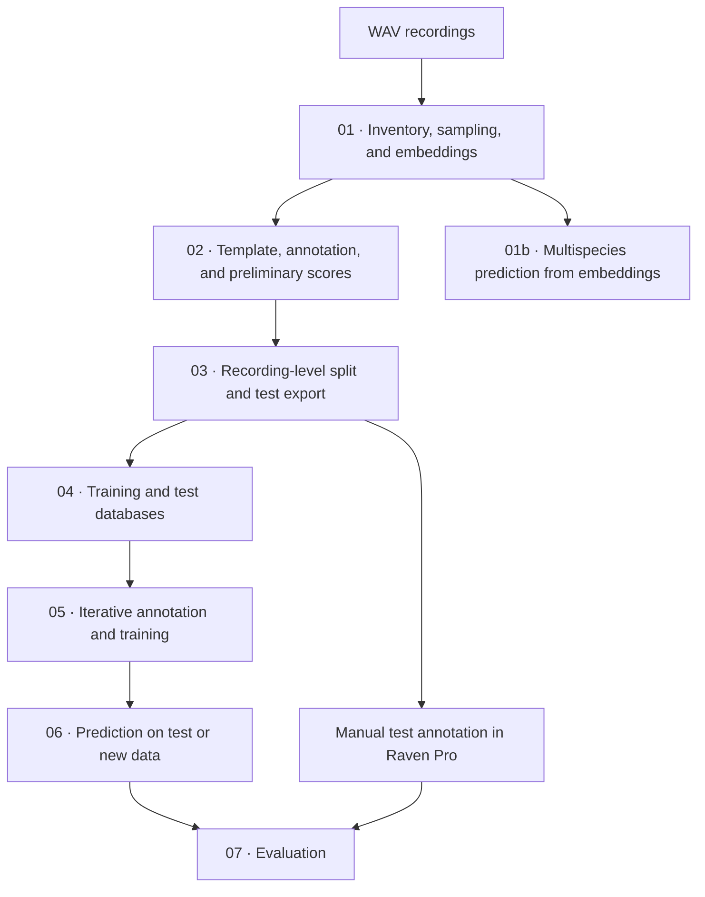

# Bioacoustic Classifier Pipeline

A Python notebook workflow for creating, applying, and evaluating bioacoustic classifiers from audio recordings. It uses **Perch** to extract embeddings—numerical representations of sound—and **Perch-Hoplite** to store them, search for similar signals, and train classifiers through iterative human annotation (*agile modeling*).

The project supports working with a target species or vocalization and also includes a **multispecies prediction** workflow that reuses embeddings with the original Perch classifier head.

## Capabilities

- Inventory WAV files and select reproducible samples by deployment (site or deployment unit) and time.
- Generate an embedding database with SQLite and USearch, including manifests and consistency checks.
- Search for vocalizations similar to a template, listen to them, and label them manually.
- Create a training and test split at the full-recording level, stratified by preliminary scores.
- Train and refine a linear classifier on the embeddings.
- Export window-level predictions and evaluate them against manual annotations.
- Obtain multispecies predictions and summaries by deployment and day or hour.

The notebooks require configuration and human review. Audio files, databases, reference annotations, and custom classifiers must be supplied or generated during the workflow; they are not included in the repository.

## Workflow


```mermaid
flowchart TD
    A[WAV recordings] --> B[01 · Inventory, sampling, and embeddings]
    B --> C[02 · Template, annotation, and preliminary scores]
    C --> D[03 · Recording-level split and test export]
    D --> E[04 · Training and test databases]
    E --> F[05 · Iterative annotation and training]
    F --> G[06 · Prediction on test or new data]
    D --> H[Manual test annotation in Raven Pro]
    G --> I[07 · Evaluation]
    H --> I
    B --> J[01b · Multispecies prediction from embeddings]
```

The `01b` workflow is optional and can be run after `01`, without completing custom training in notebooks `02` through `07`.

## Notebooks

| Notebook | Purpose | Main outputs |
|---|---|---|
| [01 · Embeddings](notebooks/01_pipeline_embeddings.ipynb) | Inventories WAV files, selects a sample, and generates embeddings with `perch_8`. | Hoplite database and `sampling_audit/` folder with a manifest, configuration, and validation results. |
| [01b · Multispecies](notebooks/01b_multispecies_from_embeddings.ipynb) | Applies the original Perch head to existing embeddings, with geographic species selection. | Parquet predictions, species lists, and CSV summaries. |
| [02 · Pattern matching](notebooks/02_pipeline_pattern%20matching.ipynb) | Searches for examples similar to a template, supports annotation, and trains a preliminary classifier. | Initial model, window-level predictions, and recording score summary. |
| [03 · Stratified split](notebooks/03_pipeline_Particion_estratificada_por_score.ipynb) | Splits full recordings by score quintiles and exports audio for review. | `recording_split.csv`, training/test tables, split manifest, and test audio. |
| [04 · Training and test databases](notebooks/04_pipeline_Train_and_Test_DB_cierre_y_limpieza.ipynb) | Copies and cleans the full database according to the split. | Separate Hoplite databases and an audit CSV of removed annotations. |
| [05 · Agile modeling](notebooks/05_pipeline_Agile%20modeling.ipynb) | Alternates search, listening, annotation, and retraining on the training set; explores a threshold using internal validation. | `.pt` classifiers and validation metrics. |
| [06 · Prediction](notebooks/06_pipeline_predecir.ipynb) | Applies the classifier to a compatible test or new-data database. | CSV with window-level logits for the selected label. |
| [07 · Evaluation](notebooks/07_pipeline_evaluar_modelo.ipynb) | Compares predictions against manual annotations and durations. | Metrics, confidence intervals, threshold analysis, and error tables. |

## Requirements and installation

The environment is declared in [`pyproject.toml`](pyproject.toml) and locked through [`uv.lock`](uv.lock). It requires **Python 3.10** and includes Perch-Hoplite `1.0.2`, TensorFlow `2.20.0`, NumPy `2.0.2`, USearch `2.25.2`, pandas, scikit-learn, and JupyterLab.

You will need Git, `uv`, access to your recordings, and sufficient storage for embeddings, copies of the training/test databases, and exported audio. Raven Pro is used outside Python for manual annotation of the test set.

From a terminal:

```bash
git clone https://github.com/telesiglab/bioacoustic_classifier_pipeline.git
cd bioacoustic_classifier_pipeline
uv python install 3.10
uv sync --locked
uv run jupyter lab
```

You can also open the project in VS Code with Python and Jupyter support and select the interpreter in `.venv` as the kernel.

Notebook `01` is prepared for native Windows. Other notebooks contain example WSL/Linux paths, such as `/mnt/d/...`. **Adapt the paths in all notebooks to your environment**; their default values do not describe a single, fully connected run. The `perch_8` model is configured to support CPU execution. Loading the model for the first time may require downloading its resources.

## Prepare the data

Notebook `01` expects WAV files and allows their organization to be configured through `dataset_fileglob` and `group_depth`. For example, with `dataset_fileglob = "*/*/*.wav"` and `group_depth = 1`:

```text
audios/
├── deployment_01/
│   └── Data/
│       └── 20260115_060000.wav
└── deployment_02/
    └── Data/
        └── 20260115_061000.wav
```

The first folder identifies the deployment. Adjust `date_regex` and `date_format` to extract dates from your filenames.

Before generating embeddings, configure:

| Parameter | What it defines |
|---|---|
| `dataset_name`, `dataset_base_path` | Dataset identity and audio folder. |
| `dataset_fileglob`, `group_depth` | WAV discovery and the folder level that identifies the deployment. |
| `db_workspace_root`, `sample_name` | Location and name of the generated database. |
| `sampling_strategy`, `random_seed` | Selection strategy and reproducibility. |
| `model_choice`, `batch_size` | Embedding model and batch size. |

The available sampling strategies are `all`, `random_fraction`, `alternate_days`, `stratified_month`, and `systematic_files`. `alternate_days` alternates the observed days within each deployment; these are not necessarily consecutive calendar days.

Embedding extraction reads audio from its original locations without copying it. Preserve these paths for subsequent listening and annotation stages. Store the Hoplite database on a stable local disk, preferably an SSD.

## Train and evaluate a custom classifier

1. **Generate embeddings (`01`).** Review the inventory and sample before starting processing. Keep `sampling_audit/sample_manifest.csv`. If you change the selection, use a different `sample_name` to avoid mixing samples.
2. **Obtain preliminary scores (`02`).** Configure the database, `query_uri`, and `query_label`. Select a representative template, review the results, and save the labels. Train the preliminary model and generate the `*_recording_summary.csv` summary used by the next notebook.
3. **Separate training and test sets (`03`).** Set `PATH_TO_RECORDING_SUMMARY` to that summary and `PATH_TO_EMBEDDINGS` to the `hoplite.sqlite` file. Adjust `N_TEST_FILES` and `SEED`. The defaults use five strata and `preliminary_top_k_mean_score`. All windows from a recording remain in the same set.
4. **Create separate databases (`04`).** Configure `COMPLETE_DB_PATH`, `TRAIN_DB_PATH`, `TEST_DB_PATH`, and `SPLIT_CSV`. In the current code, both calls use `clear_annotations=True`: preliminary training and test annotations are exported for auditing and removed from the new databases. Training in `05` starts by annotating the training set again.
5. **Annotate and train (`05`).** Work with `train_db`, save annotations, and repeat the search and training cycle. Update `model_path` and `model_output_path` between iterations. Define the operational threshold using training/validation data before examining test results.
6. **Predict (`06`).** Configure `DB_PATH`, `MODEL_PATH`, `OUTPUT_CSV_PATH`, and `TARGET_LABEL`. For evaluation, keep `EXPORT_LOGIT_THRESHOLD = -np.inf` to export all windows. The database must use embeddings compatible with the classifier.
7. **Evaluate (`07`).** Prepare manual annotations and durations, configure their paths, and set `DECISION_THRESHOLD`. Review coverage audits, metrics, and error examples.

Run the database shutdown cells before opening the databases from another notebook. In `04`, `REBUILD_SUBSET_DATABASES = True` rebuilds existing destination folders: review these paths before running it to avoid losing previous working annotations.

### Files required for evaluation

Notebook `07` reads three CSV files:

| File | Required columns with the default configuration |
|---|---|
| Predictions from `06` | `filename`, `window_start`, `window_end`, `logits`; the export also includes `idx`, `project`, and `label`. |
| Manual annotations | `filename`, `label`, `File Offset (s)`, `duration`. `Calidad` is used if quality filtering is enabled. |
| Audio durations | `filename`, `duration`. |

Times and durations are expressed in seconds. In annotations, `duration` is the event duration; in the durations table, it is the duration of the full audio file. CSV files must be prepared with this schema: the notebook does not automatically convert arbitrary tables exported by Raven.

**Verify filename correspondence:** `03` adds `recording_id` to the names of audio files copied for testing, whereas predictions may retain the original names. Use `copy_log.csv` to reconcile these names before evaluation. `07` compares basenames and does not allow different files with the same name in the durations table.

Recordings without target events must also be represented in predictions and durations, and must have been reviewed so that their windows can be treated as negatives.

### Results and interpretation

Evaluation reports precision, recall, specificity, F1, accuracy, balanced accuracy, MCC, ROC AUC, average precision, and false positives per hour. It includes window-, event-, and file-level analyses, as well as confidence intervals from a bootstrap grouped by file.

Outputs include:

- `metrics_fixed_threshold.csv` and `metrics_bootstrap_ci.csv`: metrics at the fixed threshold and uncertainty.
- `threshold_performance.csv`: exploration of behavior at different thresholds.
- `coverage_audit.csv`: temporal coverage of predictions.
- `false_positive_windows.csv`, `false_negative_windows.csv`, and `missed_annotations.csv`: examples for reviewing errors.

The classifier score is a **logit**, not a calibrated probability. Applying a sigmoid produces a value between 0 and 1, but does not establish calibration. The maximum F1 obtained by exploring the test set itself is diagnostic and should not be presented as an independent evaluation of the threshold.

Splitting by recording prevents windows from the same file from being shared between training and test sets. It does not guarantee independence across sites, campaigns, or recordings close in time; that independence must be established according to the study objective. The preliminary model from `02` is used before splitting to guide sampling, so this design should be documented when reporting results.

## Optional multispecies prediction

After `01`, open `01b_multispecies_from_embeddings.ipynb` and configure `DB_PATH`, `MODEL_CHOICE`, and `RUN_NAME`. The model and its version must match the database embeddings.

The notebook offers two methods:

- **Fast search:** retrieves candidates using approximate neighbors and recomputes their scores. It is useful for exploring detections; it does not guarantee coverage of every species, date, or deployment.
- **Exhaustive inference:** applies the classifier head to all windows in batches. Export is still limited by `EXHAUSTIVE_MIN_SCORE` and `MAX_PREDICTIONS_PER_WINDOW`; set the latter to `None` to save all classes above the threshold.

With the pinned environment, use `GEOGRAPHIC_FILTER_MODE = "csv"` or `"none"`. The `geofence_country` and `geofence_coordinates` modes require capabilities that are not part of Perch-Hoplite `1.0.2`.

For CSV filtering, complete `config/geographic_species.csv` with `scientific_name` or `perch_label`; it also supports `deployment`, `country`, `locality`, and `include`. If the file is missing, the notebook creates a template and stops so you can complete it. Adjust geographic filters to your study area and review `species_unmatched.csv`.

Outputs are saved under:

```text
outputs/multispecies/<RUN_NAME>/
├── run_metadata.json
├── species_filter/
├── fast_search/deployment=<...>/date=<...>/predictions.parquet
├── exhaustive_inference/deployment=<...>/date=<...>/predictions.parquet
└── summaries/
```

You can partition by day or hour. Hourly partitioning requires actual time metadata. Change `RUN_NAME` when changing the run configuration; resuming checks compatibility.

These outputs reuse embeddings without processing the audio again. Detections require local acoustic validation: a high score alone does not mean confirmed presence, and the absence of filtered results does not demonstrate species absence.

## Status and scope

The repository contains eight notebooks, the environment definition, the dependency lockfile, and the license. It does not include its own command-line interface or an automated end-to-end pipeline run.

The paths, labels, and model names in the cells are working examples and must be adapted. Some internal descriptions retain old notebook names or do not reflect their current parameters; the links and notes in this README follow the available files and code.

## License

The code is distributed under the **GNU General Public License, version 3**. See [`LICENSE`](LICENSE) for the full text.
